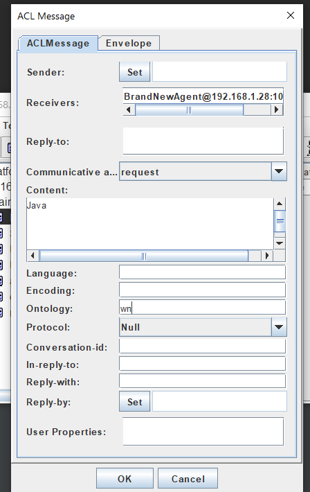
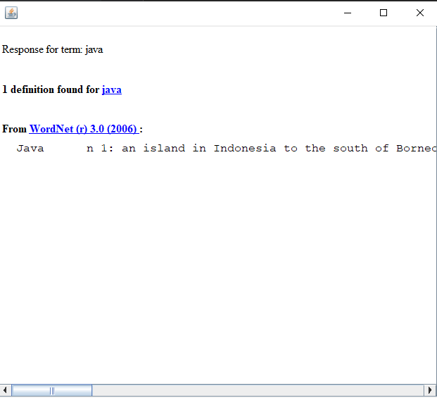

# JADE-dictionary
College project utilising JADE framework to send requests to different dictionaries via agents

## Example usage

Choose BrandNewAgent to sent request 

- Set Communicative act to request
- Content contains word that will be sent to the dictionary
- Dictionary is specified in Ontology, User must choose one from ommunicative https://dict.org/bin/Dict

Response
